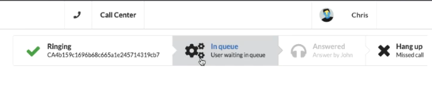

# Twilio React Node.js Call Center 📞



A **real-time call center application** built with **React**, **Node.js**, and **Twilio**, offering modern voice communication features with a sleek interface and robust architecture.

## 🔍 Description

This project implements a call center solution with real-time call handling, queue management, and agent interactions. It's split into two parts:

- **Client**: Built with **React** and **Vite**
- **Server**: Built with **Node.js** and **Express**

## 📁 Project Structure

```
.
├── client/   # React frontend (Vite)
└── server/   # Node.js backend (Express)
```

## 🚀 Features

- **Real-time Voice Calls** with Twilio
- **Call Queue Management**
- **Agent Status Tracking**
- **Real-time Updates** with Socket.IO
- **Modern UI** with Semantic UI React
- **Secure Authentication** with JWT
- **SMS Verification** for user authentication

## 🛠️ Tech Stack

### Frontend

- **React 18**
- **Vite 6**
- **Twilio Client SDK**
- **Socket.IO Client**
- **Semantic UI React**
- **Axios** (HTTP client)
- **Immer** (state management)
- **React Hooks**

### Backend

- **Node.js**
- **Express**
- **Socket.IO**
- **Twilio SDK**
- **JWT** for authentication
- **CORS** enabled
- **dotenv** for environment variables

## ⚙️ Installation

### 1. Clone the Repo

```bash
git clone https://github.com/andrew-dev-p/twilio-react-nodejs-call-center
cd twilio-react-nodejs-call-center
```

### 2. Setup Client

```bash
cd client
npm install
```

### 3. Setup Server

```bash
cd ../server
npm install
```

## 🧪 Running Locally

### Client

```bash
cd client
npm run dev
```

### Server

```bash
cd server
npm start
```

## 🔐 Environment Variables

### 📦 Client (`client/.env`)

```env
VITE_API_URL=http://localhost:3000
```

### 🔧 Server (`server/.env`)

```env
TWILIO_TOKEN_SECRET=your_twilio_token_secret
TWILIO_TOKEN_SID=your_twilio_token_sid

TWILIO_ACCOUNT_SID=your_twilio_account_sid

TWILIO_PHONE_NUMBER=your_twilio_phone_number
TWILIO_PHONE_NUMBER_SID=your_twilio_phone_number_sid

TWILIO_VERIFY_SERVICE_SID=your_twilio_verify_service_sid

TWILIO_TWIML_APP_SID=your_twilio_twiml_app_sid

MY_NUMBER=your_verified_phone_number

PORT=3000
SESSION_SECRET=your_session_secret

JWT_SECRET=your_jwt_secret
```

## 📱 Features in Detail

- **Voice Calls**: Handle incoming and outgoing calls using Twilio's Voice API
- **Call Queue**: Manage multiple calls with a queue system
- **Real-time Updates**: Live status updates using Socket.IO
- **Agent Interface**: Modern UI for call center agents
- **Authentication**: Secure login with SMS verification
- **Call Control**: Accept, reject, and transfer calls
- **Status Tracking**: Monitor agent and call status in real-time

## 🔒 Security

- JWT-based authentication
- Secure WebSocket connections
- Environment variable protection
- CORS configuration
- Twilio token-based authentication
